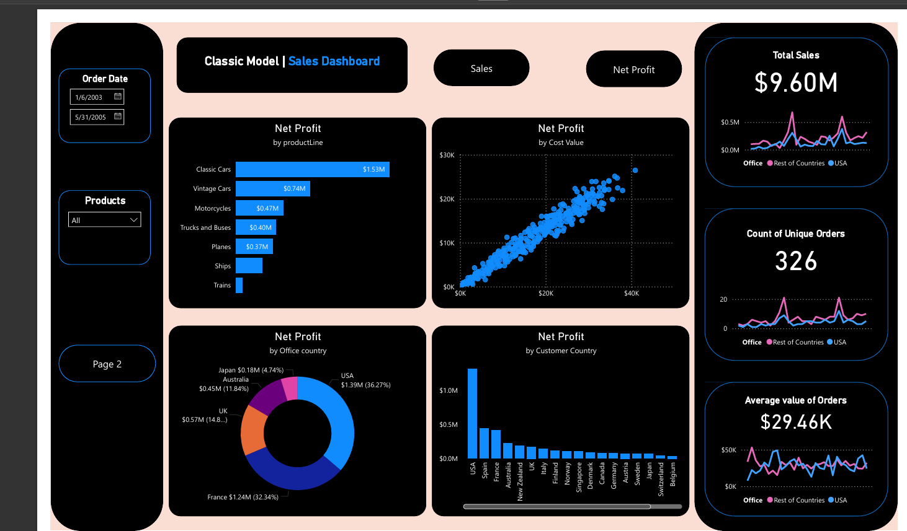

# Classic Models | Sales & Net Profit Dashboard - Power BI

## 📊 Project Overview
This project is an interactive Power BI dashboard designed to analyze the sales performance and net profitability of a "Classic Models" business. It transforms raw sales data into actionable insights through dynamic visuals, custom DAX measures, and advanced interactive features like bookmark-driven metric toggling and root-cause analysis trees.

## Sales and Net Profit Dashboard

## ✨ Key Features
- **Dynamic Metric Toggle:** Implemented custom bookmarking and a DAX `SWITCH` logic (using a disconnected parameter table) to allow users to toggle the dashboard's middle visuals between "Sales" and "Net Profit" with a single click.
- **Dynamic Chart Titles:** Configured conditional formatting so that chart titles automatically update to reflect the currently selected metric.
- **Advanced Visualizations:** - **Decomposition Tree:** Built an interactive tree to break down Net Profit/Sales by Customer Country, Product Line, and Customer Name for drill-down analysis.
  - **Scatter Plot Anomaly Detection:** Compares Cost of Sale vs. Metric(Sales or Net Profit) by Order Number, helping to quickly identify low-margin or problematic orders.
- **Time Intelligence:** Utilized Power BI Quick Measures to calculate and track **Month-over-Month (MoM) % Change**.

## Data Loading and Description
To build this dashboard, the raw data from **SalesData_PowerBI.xlsx** was loaded.
The foundational dataset contains the following key fields used throughout the dashboard:

| Field Name | Description |
| :--- | :--- |
| **Order Number** | Unique identifier for transactions; utilized in scatter plot anomaly detection. |
| **Order Date** | Transaction date; essential for filtering and Time Intelligence (MoM, YTD). |
| **Product Name** | Specific item sold; used in interactive dropdown slicers. |
| **Product Line** | Category of product (e.g., Classic Cars); used in categorical bar charts and decomposition trees. |
| **Customer Name** | Purchasing client; enables deep-dive drill-downs. |
| **Customer Country** | Client location; used in geographical column charts. |
| **Region** | Geographical grouping (USA vs. Rest of World) for high-level trend comparison. |
| **Office Location** | Corporate office tied to the sale; tracked via donut charts. |
| **Sales** | Gross order value; primary dynamic KPI. |
| **Cost of Sales** | Direct costs; evaluated against sales/profit for margin analysis. |
| **Net Profit** | Remaining profit (Sales minus Cost of Sales); secondary dynamic KPI. |

## 📂 Dashboard Structure

### Page 1: Sales & Profit Overview
The primary executive summary page focusing on high-level metrics and global trends:
- **KPI Cards:** Total Sales, Count of Unique Orders, Average Value of Each Order.
- **Trend Analysis:** Line charts tracking KPIs over time, split by a custom-grouped region field (USA vs. Rest of World).
- **Categorical Breakdown (Interactive):** 
  - Clustered Bar Chart: Metric by Product Line.
  - Scatter Plot: Cost of Sales vs. Metric by Order Number.
  - Column Chart: Metric by Customer Country.
  - Donut Chart: Metric by office locations.
- **Filters:** Interactive Order Date slicer and Product Name dropdown slicer.

### Page 2: Deep Dive & Time Intelligence
A detailed analytical view for granular data exploration:
- **Decomposition Tree:** Drilling down Net profit by Customer Country, Product Line, and Customer Name.
- **Performance Matrix (Table):** A detailed monthly breakdown displaying Sales Value, MoM % Change.

## 🛠️ Technical Skills Demonstrated
- **DAX (Data Analysis Expressions):** Creating calculated measures (e.g., Average Sales Value, Net Profit), using `SWITCH` and `SELECTEDVALUE` for dynamic controls.
- **Data Modeling:** Creating custom groupings (Binning) and disconnected tables for user selection controls.
- **Power BI Features:** Bookmarks, Selection Pane, Page Navigation actions, custom Slicers, and Conditional Formatting.
